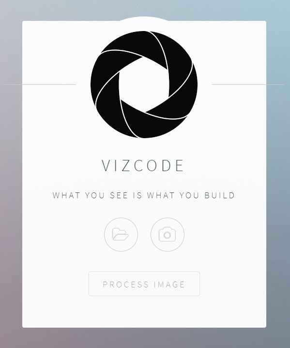
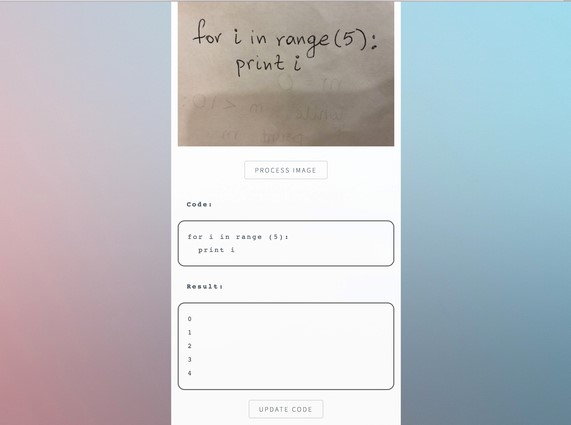
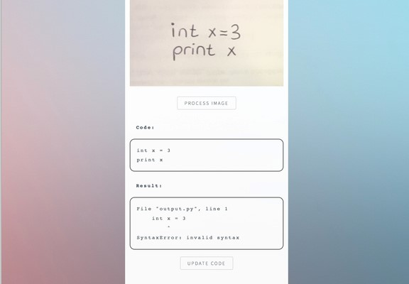

# Inspiration
We've all spent countless hours whiteboarding solutions to coding challenges, sweating over space-time complexities and wishing you could quickly check if your code actually compiles? That's why I built VizCode for you! Now you can take a picture of your code and immediately check for errors, see the output, and write extra test cases if your heart desires it!

# What it does
VizCode lets you take a picture and upload it to my servers where I analyze it using Microsoft Vision API. Your code will be automatically recognized, parsed, and finally executed! You'll immediately see your code's output and any error or warning messages. If you wish you can modify your program and write some test cases!

# How I built it
I used Microsoft's Cognitive Toolkit and Vision API to do the handwriting recognition of code and a Flask API to serve it to my beautiful website made with Javascript and HTML/CSS!

# Challenges I ran into
Handwriting recognition for code isn't where I'd want it to be. I built a set of rules that recognized common OCR deficiencies and quickly fixes them instead of training our own OCR model.

# Examples:
*Home Page:*

*Compile and see output:*

*Compile and see error messages:*

